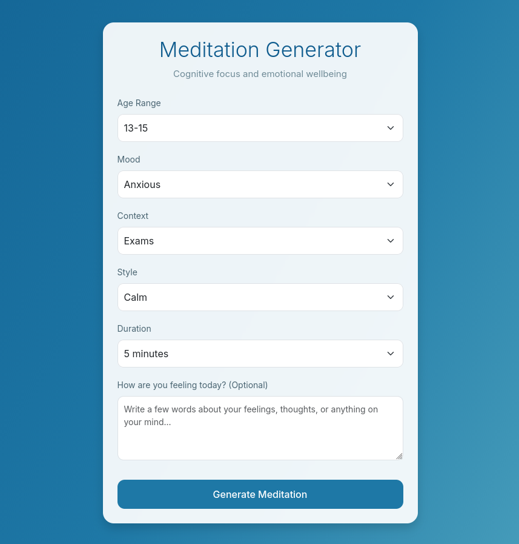
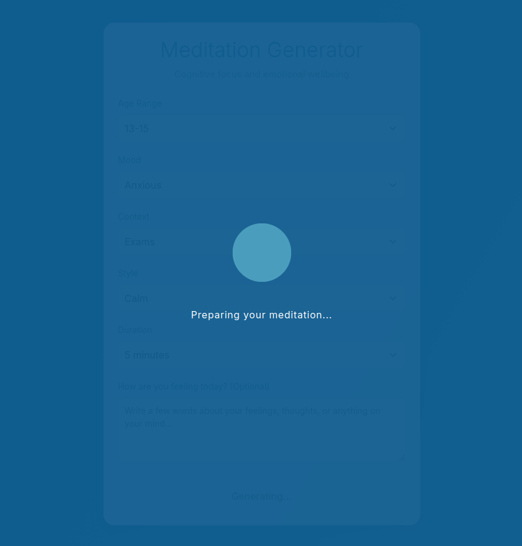
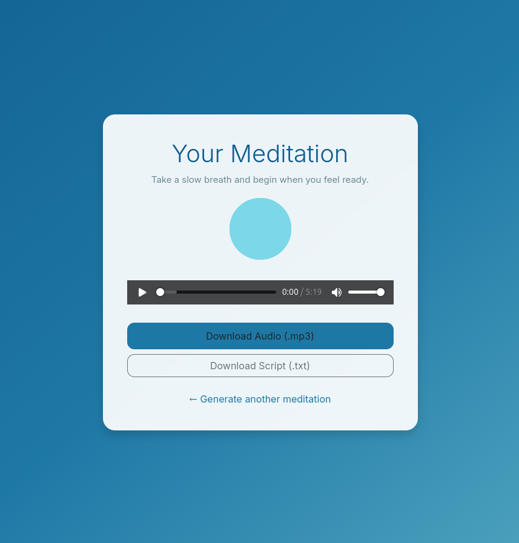
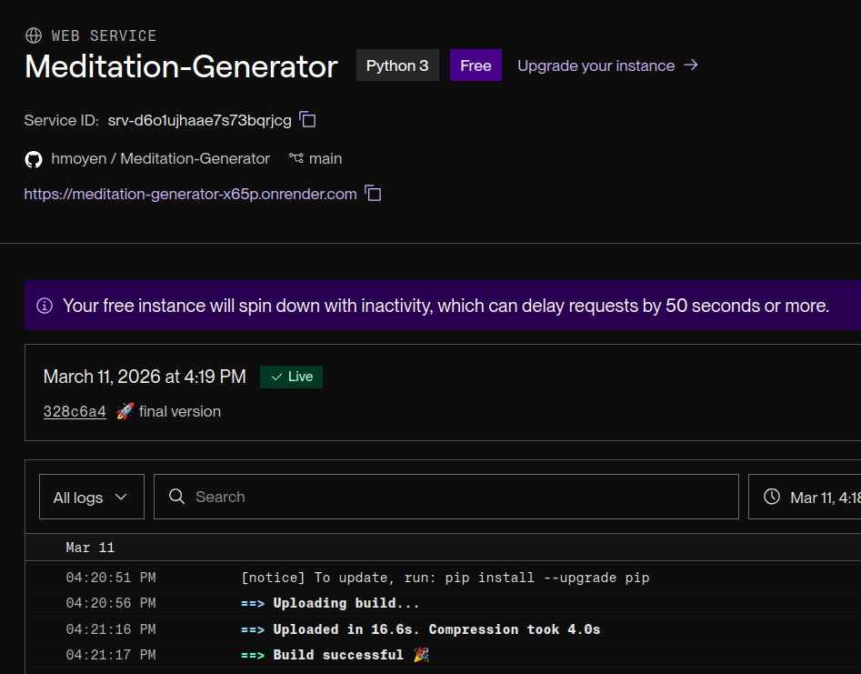
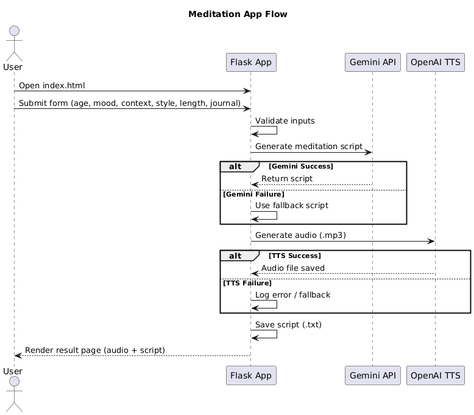

# Meditation Generator 🧘

A small Python web application that generates **personalized guided meditation audio for teenagers** based on their emotional state and academic context.

The user fills out a simple form describing their mood, study situation, and preferred meditation style.

The system then:

1. Generates a **custom meditation script** using an LLM
2. Converts the script to **spoken audio**
3. Allows the user to **play or download the meditation**

This project was built as part of the **Lapis Ater developer challenge**.







---

# Demo

**To access the Demo, use the link:**

https://meditation-generator-x65p.onrender.com/

Note: Since this is hosted on Render's free tier, the initial load may take a minute as the instance spins up after being idle.

After submitting the form, the app:

1. Generates a meditation script
2. Converts it to audio
3. Displays a page where the user can:
    - Play the meditation
    - Download the `.mp3`
    - Download the meditation script

Currently, it takes **1–2 minutes** to generate the meditation script and audio file. This could be further accelerated by optimizing the prompt, or by using faster models for both TTS and script generation if time becomes a critical requirement.

For this use case, **quality was prioritized over speed**, as delivering a more thoughtful and soothing meditation was more important. Using **gTTS** produced audio in roughly the same time, so if it had been significantly faster, I would have chosen it over the OpenAI TTS solution.

---

# Features

### Personalized Meditation

The meditation is customized based on:

- Age range
- Current mood
- Academic context
- Preferred meditation style
- Desired duration (5 or 10 minutes) - **TO BE IMPROVED**
- Optional personal reflection/journal text

The script generation uses **Google Gemini** to produce natural language meditation content suitable for teenagers.

> **Note on Duration:** Currently, the LLM generates scripts that approximate the requested time. Since script length doesn't always translate to exact audio duration, there is room to improve the system prompt to better control pacing, pauses, and word count for a more precise experience.
> 

### AI-Generated Voice Meditation

The generated script is converted into spoken audio using **OpenAI Text-to-Speech (TTS)**.
The TTS is configured with instructions to ensure (**TO BE IMPROVED**):

- Slow speaking rhythm
- Breathing pauses
- Calming tone
- Meditation-appropriate pacing

**Evolution of the Audio Pipeline:**

- **Initial Version:** First implemented using `gTTS` (Google Text-to-Speech). It provided a quick, functional, and free baseline for the project.
- **Current Version:** Upgraded to **OpenAI TTS** to achieve a more fluid and natural voice, improving the immersion of the meditation.
- **Future/Experimental:** For even higher realism, I began testing **ElevenLabs**, which offers some of the most realistic AI voices available. You can find these early experiments in the `elevenlabs_test/` folder.

### Optional Personal Reflection

Users can optionally write a short **journal entry**, which the system incorporates into the meditation (into the Gemini prompt). This makes the experience feel more personal and emotionally relevant.

### Downloadable Content

After generation, the user can:

- Listen to the meditation directly in the browser
- Download the **audio file (.mp3)**
- Download the **meditation script (.txt)**

---

# Tech Stack

**Backend**

- Python
- Flask

**AI / APIs**

- Google Gemini (meditation script generation)
- OpenAI TTS (audio generation)

**Frontend**

- HTML
- Bootstrap
- Minimal JavaScript

**Other libraries**

- python-dotenv
- UUID for unique audio file names

---

# Deployment

This application was deployed to **Render** by connecting it to this GitHub repository and configuring the required environment variables in the web service settings. The project uses **Gunicorn** for production.



---

### Database & Persistence (Future Development)

Currently, the application serves as a real-time generator. When deployed, it does not use a persistent database; generated meditations are stored temporarily in the server's local file system.

> **Note on Persistence:** On platforms like Render, the local disk is **ephemeral**. This means that whenever the server restarts or goes to sleep, any generated `.mp3` or `.txt` files are deleted.
> 

**To evolve the project, the next steps would be:**

- **Session Persistence:** Integrating a database to allow users to create accounts and save their meditation history.
- **Replayability:** Instead of only downloading files locally, users could access a personal library in the cloud to replay meditations anytime.

### Scalable Architecture (Google Cloud Migration)

First, we follow the official documentation: [Deploying a containerized app to Cloud Run](https://docs.cloud.google.com/deploy/docs/deploy-app-run). Creating a Dockerfile is straightforward with our current setup and allows the app to run consistently in the cloud.

It also includes:

| Service | Purpose in this Project |
| --- | --- |
| **Cloud Run** | Hosts the Flask container; scales automatically depending on traffic and goes down to zero when idle. |
| **Cloud Storage** | Permanent bucket for storing generated audio files. Unlike ephemeral local disk, files remain accessible via URLs. |
| **Firestore** | Flexible NoSQL database to store user profiles, meditation history, and file links. |
| **Cloud Scheduler** | Cron-like service to automatically delete old or temporary files to control storage costs. |

**Process Overview:**

1. **Containerize the app** with Docker. This ensures the Flask app runs the same way locally and in the cloud.
2. **Push the container** to Google Container Registry (GCR) or Artifact Registry.
3. **Deploy to Cloud Run**, connecting the container to a managed, auto-scaling service.
4. **Persist data** in Cloud Storage (audio/scripts) and Firestore (metadata).
5. **Schedule maintenance tasks** (e.g., deleting old files) via Cloud Scheduler.

# Project Structure

```
meditation-generator/
│
├── app.py
├── meditation.py
├── tts.py
├── requirements.txt
│
├── templates/
│   ├── index.html
│   └── result.html
│
├── static/
│   ├── audio/
│   └── scripts/
│
└── README.md
```

# Main Components

[**app.py**](http://app.py/) Main Flask application.

- **Responsibilities:**
    - Serve the HTML interface.
    - Receive form data.
    - Trigger meditation and audio generation.
    - Save files and render results page.

[**meditation.py**](http://meditation.py/) Handles **meditation script generation**.

- Uses Google Gemini to create tailored content.
- Includes breathing rhythm and pacing cues.
- Falls back to a basic meditation if the API fails.

[**tts.py**](http://tts.py/) Handles **text-to-speech generation**.

- Uses OpenAI TTS to convert text into `.mp3`.
- Streams the generated audio to a file.

**templates**

- `index.html`: Form, journal input, and loading animation.
- `result.html`: Audio player, download buttons, and breathing animation.

This diagram illustrates the flow of interactions in the meditation app, showing how the user, the Flask application, and the external APIs (Gemini and OpenAI TTS) communicate. The user submits a form with their personal and contextual inputs, which the Flask app validates before requesting a meditation script from the Gemini API. If Gemini fails, a fallback script is used. Next, the Flask app sends the script to the OpenAI TTS service to generate audio, again handling any failures gracefully. Finally, both the audio and script files are saved and presented to the user on the result page. Alternative flows are included to ensure the app continues to function smoothly even if external services fail.



Sequence diagram of the App Flow

---

# Setup (Local)

### 1. Clone the repository

```bash
git clone https://github.com/hmoyen/Meditation-Generator.git
cd meditation-generator
```

### 2. Install dependencies

```jsx
pip install -r requirements.txt
```

### 3. Create environment variables

Create a `.env` file in the project root:

```jsx
GEMINI_API_KEY=your_gemini_api_key
OPENAI_API_KEY=your_openai_api_key
```

*Note: Both services offer free tiers sufficient for testing.*

# Running the Application

Start the Flask server:

```jsx
python app.py
```

Open your browser and go to: [http://localhost:5000](https://www.google.com/search?q=http://localhost:5000)

### Application Flow

1. **User** opens the homepage and fills out the form.
2. **Flask** receives the POST request.
3. **Gemini** generates the script; **OpenAI TTS** converts it to speech.
4. **Files** are saved locally:
    - `static/audio/<uuid>.mp3`
    - `static/scripts/<uuid>.txt`
5. **Result page** displays the player and download links.